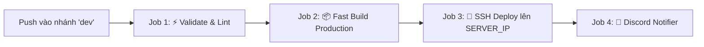

# 💻 ERP Frontend Application (`frontend`)
> **Giao diện Quản trị Đồ họa SPA Hiện đại cho Hệ sinh thái ERP Pine Drink (ERP-UTT)**

---

## 🧭 MỤC LỤC
1. [Project Overview (Tổng quan dự án)](#1-project-overview-tổng-quan-dự-án)
2. [Problem & Solution (Vấn đề & Giải pháp)](#2-problem--solution-vấn-đề--giải-pháp)
3. [Core Features (Tính năng cốt lõi)](#3-core-features-tính-năng-cốt-lõi)
4. [Business Flow (Luồng xử lý nghiệp vụ)](#4-business-flow-luồng-xử-lý-nghiệp-vụ)
5. [System Architecture (Kiến trúc hệ thống)](#5-system-architecture-kiến-trúc-hệ-thống)
6. [Tech Stack (Công nghệ sử dụng)](#6-tech-stack-công-nghệ-sử-dụng)
7. [Repository Structure (Cấu trúc thư mục)](#7-repository-structure-cấu-trúc-thư-mục)
8. [Getting Started (Bắt đầu nhanh)](#8-getting-started-bắt-đầu-nhanh)
9. [Configuration (Cấu hình hệ thống)](#9-configuration-cấu-hình-hệ-thống)
10. [API Documentation (Tích hợp API & Interceptors)](#10-api-documentation-tích-hợp-api--interceptors)
11. [Security (Bảo mật giao diện & Phân quyền UI)](#11-security-bảo-mật-giao-diện--phân-quyền-ui)
12. [Database (Quản lý Trạng thái & Client Storage)](#12-database-quản-lý-trạng-thái--client-storage)
13. [Testing (Kiểm thử giao diện & Linter)](#13-testing-kiểm-thử-giao-diện--linter)
14. [CI/CD (Tự động hóa CI/CD với GitHub Actions)](#14-cicd-tự-động-hóa-cicd-với-github-actions)
15. [Deployment (Triển khai & Nginx Web Server)](#15-deployment-triển-khai--nginx-web-server)
16. [Monitoring (Giám sát & Chẩn đoán)](#16-monitoring-giám-sát--chẩn-đoán)
17. [Development / Contribution (Quy chuẩn phát triển & Đóng góp)](#17-development--contribution-quy-chuẩn-phát-triển--đóng-góp)
18. [Documentation (Tài liệu tham chiếu)](#18-documentation-tài-liệu-tham-chiếu)

---

## 1. Project Overview (Tổng quan dự án)

`frontend` là **ứng dụng Web Single Page Application (SPA)** hiện đại, cung cấp giao diện quản trị đồ họa chuyên nghiệp, trực quan và tốc độ cao cho toàn bộ chuỗi F&B Pine Drink (ERP-UTT).

Hệ thống được phát triển trên nền tảng **Angular 21** với kiến trúc **100% Standalone Components**, quản lý trạng thái bằng **Angular Signals**, kết hợp thư viện giao diện chuẩn doanh nghiệp **NG-ZORRO (Ant Design)** và bộ **Shared UI-KIT** độc quyền.

---

## 2. Problem & Solution (Vấn đề & Giải pháp)

### 2.1. Vấn đề thực tế (Problem)
* Nhân viên vận hành chuỗi F&B phải xử lý số lượng đơn mua hàng và nhập liệu rất lớn; Giao diện chậm hoặc bắt buộc dùng chuột quá nhiều gây chậm tiến độ.
* Việc nhiều lập trình viên cùng làm việc dễ dẫn tới giao diện không đồng nhất, vỡ layout và lặp lại code UI cơ bản.
* Re-render toàn trang gây giật lag khi tải bảng dữ liệu lớn.
* Nguy cơ lộ nút thao tác nhạy cảm (như phê duyệt đơn, xóa NCC) khi người dùng không đủ quyền.

### 2.2. Giải pháp của Frontend (Solution)
* **Tối ưu Tốc độ Nhập liệu Tối đa:** Tích hợp `EnterAsTabContainerDirective` cho phép chuyển ô nhập liệu bằng phím **Enter** mượt mà như Excel, tự động tính toán tổng tiền đơn hàng thời gian thực.
* **Hiệu năng Vượt trội với Angular Signals:** Cơ chế phản ứng cục bộ giúp cập nhật chính xác phần tử DOM thay đổi, giữ vững 60 FPS.
* **Bộ Shared UI-KIT Đóng gói Sẵn:** Chuẩn hóa toàn bộ Button, Modal, Pagination, Table Search, Breadcrumbs theo Design Tokens.
* **Phân quyền Hiển thị Hạt nhân (`*hasSomeAuthority`):** Ẩn hoàn toàn các nút thao tác nhạy cảm ngay trên giao diện dựa trên quyền hạn (JWT Claims).
* **Màn hình Mẫu Chuẩn (Gold Reference Screen):** Chuẩn hóa cấu trúc theo mẫu `src/app/features/system/users`.

---

## 3. Core Features (Tính năng cốt lõi)

| Phân hệ | Thành phần | Mô tả chi tiết |
| :--- | :--- | :--- |
| **Quản trị Hệ thống (SYS)** | `Users`, `Roles`, `Permissions` | Quản lý danh sách tài khoản nội bộ, phân quyền vai trò và quản lý scope chi nhánh. |
| **Mua hàng (PROC)** | `Suppliers`, `Purchase Orders` | Hồ sơ NCC, bảng giá NVL theo NCC, wizard tạo đơn PO với Dynamic FormArray và xem trước bản in. |
| **Báo cáo Thống kê** | `Dashboard`, `ECharts` | Biểu đồ doanh thu, số lượng đơn mua hàng và phân bổ chi phí trực quan. |
| **Showcase UI-KIT** | `/ui-kit` | Trang demo và tài liệu hướng dẫn sử dụng toàn bộ các component UI dùng chung. |
| **Xác thực & Bảo mật** | `AuthGuard`, `AuthInterceptor` | Quản lý đăng nhập, tự động gắn Bearer Token và điều hướng trang bảo mật. |

---

## 4. Business Flow (Luồng xử lý nghiệp vụ)

```
[Người dùng truy cập Trình duyệt]
               │
               ▼
┌────────────────────────────────────────┐
│ NGINX Web Server (Port 80 / 443)       │ ➔ Phục vụ Bundle tĩnh (Gzip, Hashed JS/CSS Cache)
└──────────────┬─────────────────────────┘
               │ Tải SPA Bundle
               ▼
┌────────────────────────────────────────┐
│ Angular 21 Bootstrap & Routing         │ ➔ Khởi tạo AppConfig, nạp Interceptors, Routing
└──────────────┬─────────────────────────┘
               │
               ▼
┌────────────────────────────────────────┐
│ AuthGuard & Navigation                 │ ➔ Kiểm tra JWT Token trong localStorage
└──────────────┬─────────────────────────┘   (Chuyển hướng /login nếu chưa xác thực)
               │
               ▼
┌────────────────────────────────────────┐
│ Feature Component (Standalone)         │ ➔ Quản lý State bằng Signals (loading, data)
└──────────────┬─────────────────────────┘   Kế thừa BaseComponent (dọn dẹp destroy$)
               │
               ▼
┌────────────────────────────────────────┐
│ Feature Service ➔ HttpInterceptor      │ ➔ Gắn Bearer Token vào Header
└──────────────┬─────────────────────────┘   Gọi REST API Backend (/api/v1/**)
               │
               ▼
┌────────────────────────────────────────┐
│ Render Giao diện & Xử lý UX            │ ➔ Bắt lỗi HTTP qua NzMessageService
└────────────────────────────────────────┘   Tự động tính toán Reactive Forms
```

---

## 5. System Architecture (Kiến trúc hệ thống)

### 5.1. Sơ đồ Phân tầng Client-Side
```
┌────────────────────────────────────────────────────────┐
│ LAYOUTS LAYER (MainLayout, AuthLayout, Sidebar, Header)│
└───────────────────────────┬────────────────────────────┘
                            │
┌───────────────────────────▼────────────────────────────┐
│ FEATURES LAYER (system, procurement, store, home,...)  │
│  - *.component.ts (Standalone, Signals, ReactiveForms) │
│  - *.model.ts (Types, Enums, Status Badge Meta)        │
│  - *.service.ts (API Calls, Filter & Pagination State) │
└───────────────────────────┬────────────────────────────┘
                            │
┌───────────────────────────▼────────────────────────────┐
│ SHARED UI-KIT (Button, Pagination, Modal, Breadcrumbs) │
└───────────────────────────┬────────────────────────────┘
                            │
┌───────────────────────────▼────────────────────────────┐
│ CORE LAYER (Auth, Guards, Interceptors, Notifications) │
└────────────────────────────────────────────────────────┘
```

### 5.2. Màn hình Mẫu Chuẩn (Gold Reference Screen)
Mọi màn hình mới **bắt buộc tuân thủ cấu trúc** tại [`src/app/features/system/users`](file:///c:/ERP-UTT/frontend/src/app/features/system/users):
* `user.model.ts`: Định nghĩa Type Interface, Status Enum, Badge Helper (`getUserStatusMeta`).
* `user.service.ts`: Xử lý Observable API, filter và phân trang.
* `user-list.component.ts`: Standalone, Signals, Reactive Form, cleanup qua `takeUntil(this.destroy$)`.

---

## 6. Tech Stack (Công nghệ sử dụng)

* **Framework:** Angular 21 (v21.2.21).
* **Ngôn ngữ:** TypeScript 5.9+ (Strict Mode).
* **UI Component Library:** NG-ZORRO (Ant Design for Angular) 21.3.1.
* **Biểu đồ:** Apache ECharts 6.1.0.
* **Quản lý Bất đồng bộ & State:** RxJS 7.8.2, Angular Signals.
* **Tối ưu hóa Cuộn & Layout:** overlayscrollbars-ngx 0.5.2, ngx-infinite-scroll 21.0.0.
* **Build Engine:** Angular Custom Esbuild Builder.
* **Kiểm thử:** Vitest 4.1.7, JSDOM 29.1.1.
* **Chất lượng Code:** ESLint 10.4.0, Prettier 3.8.3, angular-eslint.

---

## 7. Repository Structure (Cấu trúc thư mục)

```
frontend/
├── package.json                              # Quản lý Dependencies & Scripts
├── angular.json                              # Cấu hình Angular Workspace & Build Target
├── proxy.config.mjs                          # Proxy dev server trỏ về backend API
├── deploy/                                   # Kịch bản & Tài liệu triển khai Server
│   ├── DEPLOYMENT_GUIDE.md                   # Hướng dẫn chi tiết triển khai & CI/CD
│   ├── nginx/
│   │   └── erp-utt.conf                      # File cấu hình Nginx Server Block
│   └── scripts/
│       ├── deploy.sh                         # Script triển khai Atomic trên Server
│       ├── rollback.sh                       # Script Rollback tức thì trong 1 giây
│       ├── 01-build-transfer.ps1 / .sh       # Script build tay từ máy Dev
│       ├── 02-setup-nginx.sh                 # Cài đặt và cấu hình Nginx lần đầu
│       └── 03-check-status.sh                # Kiểm tra chẩn đoán sức khỏe hệ thống
├── src/
│   ├── app/
│   │   ├── core/                             # Auth, Guards, Interceptors, Core Services
│   │   ├── features/                         # Các phân hệ nghiệp vụ (Lazy Loaded)
│   │   │   ├── system/                       # Quản trị hệ thống (Màn hình mẫu users/)
│   │   │   ├── procurement/                  # Mua hàng & Quản lý NCC
│   │   │   ├── store/                        # Quản lý Cửa hàng / Chi nhánh
│   │   │   ├── ui-kit/                       # Trang Showcase tài liệu UI-KIT
│   │   │   ├── home/                         # Dashboard tổng quan
│   │   │   └── login/                        # Màn hình Đăng nhập
│   │   ├── shared/                           # UI-KIT Components, Directives, Pipes
│   │   │   ├── components/                   # app-button, app-pagination, app-modal,...
│   │   │   ├── directives/                   # EnterAsTabDirective, HasSomeAuthorityDirective
│   │   │   └── pipes/                        # CurrencyVndPipe, DateFormatPipe
│   │   ├── layouts/                          # MainLayout, AuthLayout, Sidebar, Header
│   │   ├── app.config.ts                     # Cấu hình Providers, Router, Interceptors
│   │   └── app.routes.ts                     # Định tuyến chính SPA
│   ├── assets/                               # Hình ảnh, icons, font tĩnh
│   └── styles.scss                           # Biến màu, Typography & Design Tokens
```

---

## 8. Getting Started (Bắt đầu nhanh)

### 8.1. Yêu cầu Môi trường
* **Node.js:** Phiên bản **>= 24.0.0** (`node -v`).
* **npm:** Phiên bản **>= 10.0.0** (`npm -v`).
* **Angular CLI:** Phiên bản 21.x (`npm install -g @angular/cli`).

### 8.2. Khởi chạy Ứng dụng Local

```powershell
# 1. Cài đặt các gói thư viện
cd c:/ERP-UTT/frontend
npm install

# 2. Khởi chạy máy chủ phát triển (HMR)
npm start

# Hoặc chạy lệnh Angular CLI trực tiếp
ng serve
```

Mở trình duyệt tại: **`http://localhost:4200/`** (Ứng dụng tự động tải lại khi sửa code).

---

## 9. Configuration (Cấu hình hệ thống)

### 9.1. Cấu hình Proxy Gọi API Local (`proxy.config.mjs`)
Tự động chuyển tiếp toàn bộ request `/api/**` về máy chủ Backend:
```javascript
export default [
  {
    context: ['/api'],
    target: process.env.BACKEND_URL || 'http://localhost:8080',
    secure: false,
    changeOrigin: true
  }
];
```

### 9.2. Biến Môi trường Triển khai Server
* `SERVER_IP`: Địa chỉ IP của máy chủ VPS.
* `WEB_ROOT`: Thư mục phục vụ mã nguồn tĩnh (`/opt/ERP-UTT/frontend/browser`).

---

## 10. API Documentation (Tích hợp API & Interceptors)

* **`AuthInterceptor`:** Tự động lấy Access Token từ Storage và gắn vào Header:
  `Authorization: Bearer <token>`.
* **`ErrorInterceptor`:** Bắt mã lỗi HTTP toàn cục:
  * `401 Unauthorized`: Xóa token và điều hướng về trang `/login`.
  * `403 Forbidden`: Chuyển hướng sang trang `/error/403` hoặc hiển thị thông báo.
  * `400 Bad Request` / `500 Server Error`: Đọc cấu trúc `ProblemDetail` (RFC 7807) và hiển thị Toast thông báo qua `NzMessageService`.

---

## 11. Security (Bảo mật giao diện & Phân quyền UI)

* **Bảo vệ Route:** `AuthGuard` kiểm tra trạng thái xác thực và hạn dùng của JWT token trước khi cho phép truy cập.
* **Chỉ thị Phân quyền Nút Bấm (`*hasSomeAuthority`):**
  ```html
  <app-button *hasSomeAuthority="['PROC_PO_APPROVE']" btnType="primary" (click)="approvePo()">
    Phê duyệt đơn
  </app-button>
  ```
* **Chống XSS:** Tự động sanitize nội dung HTML qua Angular Security Context và `SafeHtmlPipe`.

---

## 12. Database (Quản lý Trạng thái & Client Storage)

* **Angular Signals:** Quản lý Local State phản ứng tức thì (`loading = signal(false)`, `suppliers = signal<Supplier[]>([])`).
* **LocalStorage:** Lưu trữ Access Token, Refresh Token, Thông tin tài khoản đăng nhập và Theme cài đặt.
* **Dọn dẹp Bộ nhớ (Memory Leak Prevention):** 100% Component kế thừa `BaseComponent` và dọn dẹp Subscription bằng `takeUntil(this.destroy$)`.

---

## 13. Testing (Kiểm thử giao diện & Linter)

```powershell
# Chạy toàn bộ Unit Tests với Vitest
npm test

# Chạy Unit Test ở chế độ Watch
npm run test:watch

# Kiểm tra Linter & Quy chuẩn Code
npm run lint

# Tự động sửa lỗi Linter
npm run lint:fix
```

---

## 14. CI/CD (Tự động hóa CI/CD với GitHub Actions)

Quy trình CI/CD được định nghĩa tại `.github/workflows/ci-cd.yml`, tự động kích hoạt khi merge code vào nhánh **`dev`**:



---

## 15. Deployment (Triển khai & Nginx Web Server)

* **Hệ điều hành Server:** Ubuntu 24.04 LTS (Địa chỉ máy chủ: `SERVER_IP`).
* **Đường dẫn thư mục tĩnh:** `/opt/ERP-UTT/frontend/browser/`.

### 15.1. Kiến trúc Nginx Reverse Proxy
```
                     [NGƯỜI DÙNG / TRÌNH DUYỆT]
                                  │
                                  │ HTTP Port 80 (443 HTTPS)
                                  ▼
          ┌────────────────────────────────────────────────┐
          │          NGINX REVERSE PROXY (Port 80)         │
          │  - Gzip nén dữ liệu (tiết kiệm 70% băng thông) │
          │  - Caching 1 năm cho Hashed Chunks (JS/CSS)    │
          │  - no-cache cho index.html                     │
          │  - SPA Fallback routing (try_files index.html) │
          └───────────────┬────────────────┬───────────────┘
                          │                │
        [Request tĩnh]    │                │   [Request API]
  (HTML, JS chunks, CSS)  │                │   (/api/v1/**)
                          ▼                ▼
        ┌──────────────────────┐   ┌────────────────────────┐
        │    ANGULAR 21 SPA    │   │  BACKEND SERVICE       │
        │ /opt/ERP-UTT/frontend│   │  Spring Boot (Docker)  │
        │ /browser/            │   │  Port 8080             │
        └──────────────────────┘   └────────────────────────┘
```

### 15.2. Rollback Tức thì trong 1 Giây
```bash
ssh root@SERVER_IP
sudo bash /opt/ERP-UTT/frontend/deploy/scripts/rollback.sh
```

### 15.3. Build & Deploy Thủ công từ Máy Dev
```powershell
# Chạy từ máy Windows PowerShell
.\frontend\deploy\scripts\01-build-transfer.ps1
```

---

## 16. Monitoring (Giám sát & Chẩn đoán)

### 16.1. Chẩn đoán Nhanh Hệ thống
```bash
bash /opt/ERP-UTT/frontend/deploy/scripts/03-check-status.sh
```

### 16.2. Xem Logs Nginx theo Thời gian thực
```bash
# Log truy cập
tail -f /var/log/nginx/access.log

# Log lỗi
tail -f /var/log/nginx/error.log
```

---

## 17. Development / Contribution (Quy chuẩn phát triển & Đóng góp)

### 17.1. Git Flow & Đặt tên Nhánh
* Nhánh gốc checkout: **`dev`**
* Cú pháp nhánh tính năng: `feature/{tên_dev}/{mã_task}` *(Ví dụ: `feature/luc/S2-07`)*
* Cú pháp nhánh sửa lỗi: `fixbug/{tên_dev}/{mã_task}` *(Ví dụ: `fixbug/luc/S2-07`)*
* **Nhánh đích khi tạo Pull Request (Target Branch):** 👉 **`dev-2`** *(Sprint 2)* hoặc **`dev`**.

### 17.2. Quy chuẩn Commit Message
* Cú pháp: `feat(mã_task): mô tả` hoặc `fix(mã_task): mô tả`
* *Ví dụ:* `feat(S2-07): create Supplier list, search and modal create/edit form`

### 17.3. Điều kiện Merge PR
1. 🟢 Có tối thiểu **01 Approval** từ Reviewer (`@hoangdinhdung05` hoặc `@hoan`).
2. 🟢 Resolve 100% review comments.
3. 🟢 Lệnh `npm run build` và `npm run lint` thành công 100% không lỗi.
4. 🟢 Giao diện responsive chuẩn đẹp, không vỡ layout.

---

## 18. Documentation (Tài liệu tham chiếu)

* 📄 [QUY CHUẨN PHÁT TRIỂN FRONTEND (DEV_GUIDELINES.md)](file:///c:/ERP-UTT/frontend/DEV_GUIDELINES.md)
* 📄 [HƯỚNG DẪN VẬN HÀNH CI/CD FRONTEND (deploy/DEPLOYMENT_GUIDE.md)](file:///c:/ERP-UTT/frontend/deploy/DEPLOYMENT_GUIDE.md)
* 📄 [KẾ HOẠCH PHÁT TRIỂN FE SPRINT 2 (docs/sprint-2/02_DEV_KE_HOACH_FE_BE.md)](file:///c:/ERP-UTT/docs/sprint-2/02_DEV_KE_HOACH_FE_BE.md)
* 📄 [TÀI LIỆU SHOWCASE UI-KIT (src/app/features/ui-kit)](file:///c:/ERP-UTT/frontend/src/app/features/ui-kit)
